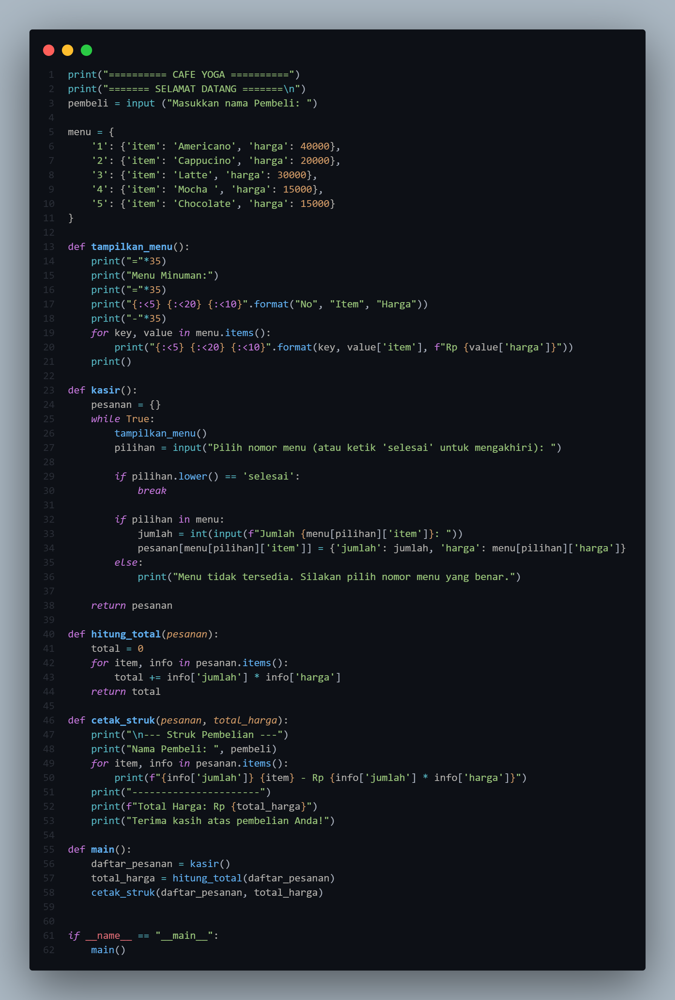
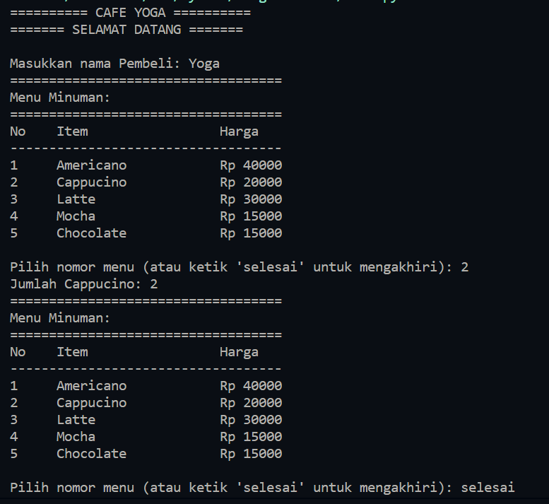
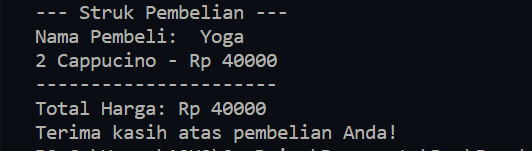

# Project-UAS

# CODE


# OUTPUT



# PENJELASAN

1. Dictionary Menu (menu): Pada bagian awal program, terdapat sebuah dictionary yang menyimpan opsi pilihan minuman beserta harganya. Setiap item dalam dictionary berisi nama minuman sebagai kunci (key) dan harga sebagai nilai (value).

```python
menu = {
    '1': {'item': 'Americano', 'harga': 40000},
    '2': {'item': 'Cappucino', 'harga': 20000},
    '3': {'item': 'Latte', 'harga': 30000},
    '4': {'item': 'Mocha ', 'harga': 15000},
    '5': {'item': 'Chocolate', 'harga': 15000}
}
```
2. Fungsi tampilkan_menu(): bertujuan untuk mencetak menu minuman beserta harganya kepada pengguna.
```python
def tampilkan_menu():
    print("="*35)
    print("Menu Minuman:")
    print("="*35)
    print("{:<5} {:<20} {:<10}".format("No", "Item", "Harga"))
    print("-"*35)
    for key, value in menu.items():
        print("{:<5} {:<20} {:<10}".format(key, value['item'], f"Rp {value['harga']}"))
    print()
```

3. Fungsi kasir(): untuk mengambil pesanan dari menu yang telah ditampilkan sebelumnya menggunakan fungsi tampilkan_menu()

```python
def kasir():
    pesanan = {}
    while True:
        tampilkan_menu()
        pilihan = input("Pilih nomor menu (atau ketik 'selesai' untuk mengakhiri): ")
        
        if pilihan.lower() == 'selesai':
            break
        
        if pilihan in menu:
            jumlah = int(input(f"Jumlah {menu[pilihan]['item']}: "))
            pesanan[menu[pilihan]['item']] = {'jumlah': jumlah, 'harga': menu[pilihan]['harga']}
        else:
            print("Menu tidak tersedia. Silakan pilih nomor menu yang benar.")

    return pesanan
```
4. Fungsi hitung_total(pesanan): Fungsi ini menerima dua parameter, yaitu harga dan jumlah minuman yang dipesan, lalu menghitung total harga pesanan.
```python
def hitung_total(pesanan):
    total = 0
    for item, info in pesanan.items():
        total += info['jumlah'] * info['harga']
    return total
```

5. Fungsi cetak_struk(pesanan, total_harga): Fungsi ini untuk mencetak struk pembelian
```python
def cetak_struk(pesanan, total_harga):
    print("\n--- Struk Pembelian ---")
    print("Nama Pembeli: ", pembeli)
    for item, info in pesanan.items():
        print(f"{info['jumlah']} {item} - Rp {info['jumlah'] * info['harga']}")
    print("----------------------")
    print(f"Total Harga: Rp {total_harga}")
    print("Terima kasih atas pembelian Anda!")
```
6.  Fungsi main(): fungsi utama yang mengendalikan alur program secara keseluruhan
```python
def main():
    daftar_pesanan = kasir()
    total_harga = hitung_total(daftar_pesanan)
    cetak_struk(daftar_pesanan, total_harga)
```

7. Fungsi Utama (if name == "main":): Baris ini memastikan bahwa fungsi main() akan dijalankan ketika program dieksekusi.
```python
if __name__ == "__main__":
    main()
```
